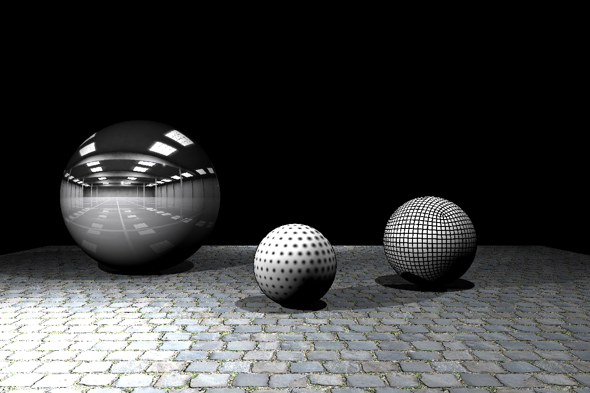
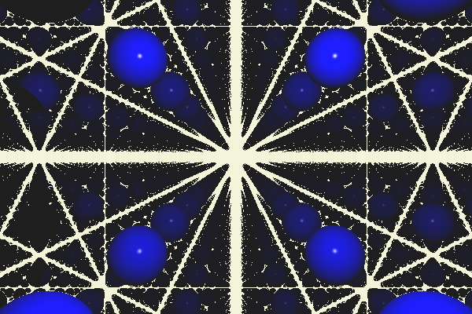
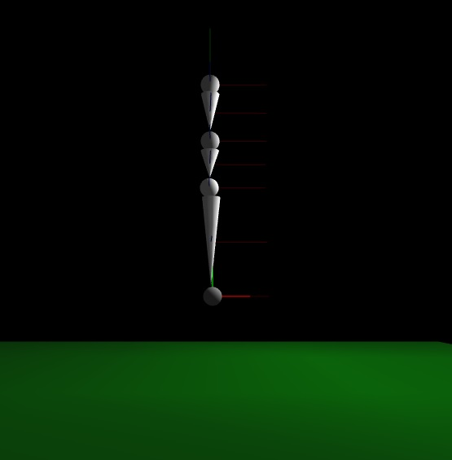

# C++ Computer Graphics

## Environment Setup

These projects were all built using the OpenFrameworks libaray in Visual Studio. Inside the bin directory for all projects is a OpenFrameworks debug executable file that can be run to see and interact with the scene objects.

## Reflective Surface Ray Tracing

This project includes a ray tracer that supports reflective surfaces. The reflective surface is a mirror that calculates the view ray as it bounces off the intersection point and takes the color of the next intersection point. The ray tracer also supports soft shadows and phong shading.

## Texture Mapping

This project includes a ray tracer that supports texture mapping. The texture mapping is a 2D image that is mapped to a 3D object. The spheres in this example are mapped using polar coordinate mapping to create a seamless effect across the entire surface.

## Ray Marching

This project includes a ray marcher that takes one instance of a scene object and uses the modulo operator to repeat it as an infinite grid. 

## Skeleton Joints

This project includes a skeleton builder that adds child joints to parent joints. As joints are moved around the scene, the child joints are transformed relative to the parent joint's movement. A joint can be dragged around the scene with the mouse or spun around the x, y, and z axes.